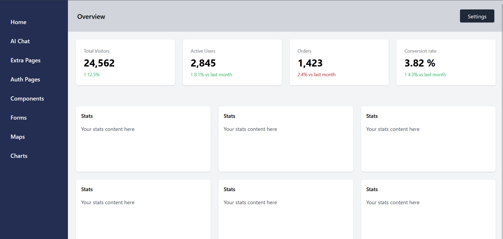

# Admin Dashboard UI

A simple and clean **admin dashboard layout** built while learning **Tailwind CSS**.  
This mini project was created to understand the fundamentals of **layouts, grids, flex utilities, and responsive design** using Tailwind 3.

---

## About

This project is a basic **dashboard interface**, similar to what you’d find in admin panels or analytics tools.  
It includes a sidebar, a top navigation bar (header), and a responsive grid of cards that adjust to different screen sizes.  

The goal of this exercise was to:
- Practice Tailwind CSS classes and responsive utilities.
- Learn how to build a real-world web layout structure.
- Get comfortable working with `flex`, `grid`, and `h-screen` to organize full-page designs.

---

## Getting Started

To start using or editing this project, you’ll need **Tailwind CSS 3** installed locally.

### 🧩 Installation

Run these commands in your terminal:

```bash
# Initialize your project
npm init -y

# Install Tailwind CSS v3
npm install -D tailwindcss@3

# Create Tailwind config
npx tailwindcss init -d
```

### Build and Watch

Once Tailwind is set up, you can build and watch for changes:

```bash
npm run build
npm run watch
```

This will compile your Tailwind styles and update automatically when you make changes.

---

## Tech Stack

- **HTML5** – for structure  
- **Tailwind CSS 3** – for styling and layout  
- **Node.js + npm** – for managing Tailwind setup and builds  

---

## Preview



---

## What I Learned

- Building a full-page layout with `flex` and `grid`.
- Making a responsive dashboard interface.
- Structuring reusable components like sidebars, headers, and cards.
- Using Tailwind’s `md:` and `lg:` prefixes for responsive design.

---

## License

This project is licensed under the **MIT License**.  
Feel free to use it for learning or your own small projects.

---

Created by blevins_dev 
Learning and improving one Tailwind component at a time.
